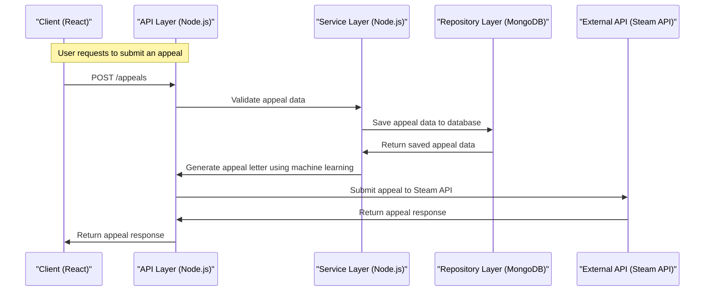

# Steam Appeal Process Automator
### MVP Architecture Document
> **Team:** talha · **Duration:** 12 weeks · **Stack:** React, Node.js, Machine Learning

---

## 1. Executive Summary
The Steam Appeal Process Automator is a web application designed to automate the appeal process for Steam users who have been wrongfully banned. The application will use machine learning to analyze ban reasons and generate optimized appeal letters. The system will also provide users with a dashboard to track their appeal status and receive updates on their case. The goal of this project is to create a user-friendly and efficient appeal process that increases the chances of a successful appeal.

The Steam Appeal Process Automator will solve the problem of the current manual appeal process being time-consuming and often unsuccessful. The application will provide a streamlined process for users to submit their appeals, and the machine learning algorithm will help to increase the chances of a successful appeal. The dashboard will also provide users with real-time updates on their appeal status, allowing them to stay informed throughout the process.

The Steam Appeal Process Automator will deliver value to users by providing a convenient and effective way to appeal their bans. The application will also provide valuable insights and analytics to Steam, allowing them to improve their ban appeal process and reduce the number of incorrect bans.

## 2. System Architecture Overview

### 2.1 High-Level Architecture Diagram
```
+---------------+
|  Client    |
+---------------+
       |
       |
       v
+---------------+
|  API Layer  |
|  (Node.js)   |
+---------------+
       |
       |
       v
+---------------+
|  Middleware  |
|  (Redis)      |
+---------------+
       |
       |
       v
+---------------+
|  Service Layer|
|  (Node.js)    |
+---------------+
       |
       |
       v
+---------------+
|  Repository  |
|  Layer (MongoDB)|
+---------------+
       |
       |
       v
+---------------+
|  Database     |
|  (MongoDB)    |
+---------------+
       |
       |
       v
+---------------+
|  External API |
|  (Steam API)   |
+---------------+
```

### 2.2 Request Flow Diagram (Mermaid)


### 2.3 Architecture Pattern
The Steam Appeal Process Automator will use a layered architecture pattern. This pattern is suitable for this project because it allows for a clear separation of concerns between the different layers of the application. The client layer will handle user input and display the user interface, the API layer will handle requests and responses, the service layer will handle business logic, and the repository layer will handle data storage and retrieval.

### 2.4 Component Responsibilities
The Client component is responsible for handling user input and displaying the user interface. It will communicate with the API layer to submit appeals and retrieve appeal responses. The API layer is responsible for handling requests and responses, and will communicate with the service layer to validate appeal data and generate appeal letters. The service layer is responsible for handling business logic, and will communicate with the repository layer to save and retrieve appeal data. The repository layer is responsible for handling data storage and retrieval, and will communicate with the database to save and retrieve appeal data.

## 3. Tech Stack & Justification

| Layer | Technology | Why chosen |
|-------|-----------|------------|
| Client | React | A popular and widely-used JavaScript library for building user interfaces. |
| API Layer | Node.js | A fast and scalable JavaScript runtime environment for building server-side applications. |
| Middleware | Redis | A fast and efficient in-memory data store for caching and queuing. |
| Service Layer | Node.js | A fast and scalable JavaScript runtime environment for building server-side applications. |
| Repository Layer | MongoDB | A popular and widely-used NoSQL database for storing and retrieving data. |
| Database | MongoDB | A popular and widely-used NoSQL database for storing and retrieving data. |
| External API | Steam API | The official API for Steam, used for submitting appeals and retrieving responses. |

## 4. Database Design

### 4.1 Entity-Relationship Diagram
```mermaid
erDiagram
    APPEAL ||--|{ USER : has
    APPEAL {
        int id
        string reason
        string appealLetter
        datetime createdAt
        datetime updatedAt
    }
    USER ||--|{ APPEAL : submits
    USER {
        int id
        string username
        string email
        datetime createdAt
        datetime updatedAt
    }
    APPEAL_STATUS ||--o|{ APPEAL : has
    APPEAL_STATUS {
        int id
        string status
        datetime createdAt
        datetime updatedAt
    }
    BAN_REASON ||--o|{ APPEAL : has
    BAN_REASON {
        int id
        string reason
        datetime createdAt
        datetime updatedAt
    }
```

### 4.2 Relationship & Association Details
The Appeal entity has a one-to-many relationship with the User entity, as a user can submit multiple appeals. The Appeal entity also has a one-to-one relationship with the AppealStatus entity, as an appeal can have only one status. The Appeal entity also has a many-to-one relationship with the BanReason entity, as an appeal can be related to multiple ban reasons.

The business rule that drives the relationship between Appeal and User is that a user can submit multiple appeals. The cardinality of this relationship is one-to-many, and it is enforced at the application level. The join strategy is to use the user's ID to retrieve their appeals.

The business rule that drives the relationship between Appeal and AppealStatus is that an appeal can have only one status. The cardinality of this relationship is one-to-one, and it is enforced at the application level. The join strategy is to use the appeal's ID to retrieve its status.

The business rule that drives the relationship between Appeal and BanReason is that an appeal can be related to multiple ban reasons. The cardinality of this relationship is many-to-one, and it is enforced at the application level. The join strategy is to use the ban reason's ID to retrieve its related appeals.

### 4.3 Schema Definitions (Code)
```javascript
const mongoose = require('mongoose');

const appealSchema = new mongoose.Schema({
  reason: String,
  appealLetter: String,
  createdAt: Date,
  updatedAt: Date,
});

const userSchema = new mongoose.Schema({
  username: String,
  email: String,
  createdAt: Date,
  updatedAt: Date,
});

const appealStatusSchema = new mongoose.Schema({
  status: String,
  createdAt: Date,
  updatedAt: Date,
});

const banReasonSchema = new mongoose.Schema({
  reason: String,
  createdAt: Date,
  updatedAt: Date,
});
```

### 4.4 Indexing Strategy
The following indexes will be created:

* A single index on the Appeal entity's reason field to optimize queries by reason.
* A compound index on the User entity's username and email fields to optimize queries by username and email.
* A single index on the AppealStatus entity's status field to optimize queries by status.

### 4.5 Data Flow Between Entities
When a user submits an appeal, the following entities are created or updated:

* A new Appeal entity is created with the user's ID and the appeal's reason and appeal letter.
* The User entity is updated with the user's ID and the appeal's ID.
* A new AppealStatus entity is created with the appeal's ID and the initial status.
* The BanReason entity is updated with the ban reason's ID and the appeal's ID.

## 5. API Design

### 5.1 Authentication & Authorization
The API will use JSON Web Tokens (JWT) for authentication. When a user logs in, a JWT token will be generated and returned in the response. The token will be validated on each subsequent request to protected routes.

### 5.2 REST Endpoints
The following endpoints will be implemented:

| Method | Path | Auth | Request Body | Response | Description |
|--------|------|------|--------------|----------|-------------|
| POST | /appeals | Required | { reason, appealLetter } | { id, reason, appealLetter, status } | Submit an appeal |
| GET | /appeals | Required |  | [ { id, reason, appealLetter, status } ] | Retrieve a list of appeals |
| GET | /appeals/:id | Required |  | { id, reason, appealLetter, status } | Retrieve an appeal by ID |
| PUT | /appeals/:id | Required | { reason, appealLetter } | { id, reason, appealLetter, status } | Update an appeal |
| DELETE | /appeals/:id | Required |  |  | Delete an appeal |

### 5.3 Error Handling
The API will use a standard error response format with the following fields:

* code: A unique error code.
* message: A human-readable error message.
* details: Additional error details.

HTTP status codes will be used to indicate the type of error:

* 400: Bad Request
* 401: Unauthorized
* 403: Forbidden
* 404: Not Found
* 500: Internal Server Error

## 6. Frontend Architecture

### 6.1 Folder Structure
The frontend code will be organized in the following folders:

* components: React components.
* containers: React containers.
* actions: Action creators.
* reducers: Reducers.
* utils: Utility functions.
* api: API client.

### 6.2 State Management
The application will use Redux for state management. The state will be divided into the following slices:

* appeals: Appeals state.
* users: Users state.
* appealStatus: Appeal status state.

### 6.3 Key Pages & Components
The following pages and components will be implemented:

* AppealForm: A form for submitting an appeal.
* AppealList: A list of appeals.
* AppealDetail: A detailed view of an appeal.
* UserDashboard: A dashboard for users to view their appeals.

## 7. Core Feature Implementation

### 7.1 Automated Appeal Letter Generation
The automated appeal letter generation feature will use a machine learning model to generate an appeal letter based on the user's input.

* User flow: The user submits an appeal with their reason and appeal letter.
* Frontend: The AppealForm component handles the user input and sends a request to the API to generate an appeal letter.
* API call: The API generates an appeal letter using a machine learning model and returns it in the response.
* Backend logic: The API uses a machine learning library to generate an appeal letter based on the user's input.
* Database: The generated appeal letter is stored in the database.
* AI integration: The machine learning model is trained on a dataset of successful appeals and uses natural language processing to generate an appeal letter.
* Code snippet:
```javascript
const ml = require('ml');

const generateAppealLetter = (reason, appealLetter) => {
  const model = ml.load_model('appeal-letter-model');
  const input = { reason, appealLetter };
  const output = model.predict(input);
  return output;
};
```

### 7.2 Ban Reason Analysis
The ban reason analysis feature will analyze the user's ban reason and provide a recommendation for the appeal.

* User flow: The user submits an appeal with their ban reason.
* Frontend: The AppealForm component handles the user input and sends a request to the API to analyze the ban reason.
* API call: The API analyzes the ban reason and returns a recommendation in the response.
* Backend logic: The API uses a rules engine to analyze the ban reason and provide a recommendation.
* Database: The ban reason and recommendation are stored in the database.
* AI integration: The rules engine uses a knowledge graph to analyze the ban reason and provide a recommendation.
* Code snippet:
```javascript
const rulesEngine = require('rules-engine');

const analyzeBanReason = (banReason) => {
  const rules = [
    {
      condition: (input) => input.banReason === 'hack',
      action: (input) => 'Provide evidence of innocence',
    },
    {
      condition: (input) => input.banReason === 'toxicity',
      action: (input) => 'Apologize for behavior',
    },
  ];
  const engine = new rulesEngine.RulesEngine();
  engine.addRules(rules);
  const output = engine.run(banReason);
  return output;
};
```

### 7.3 Appeal Status Tracking
The appeal status tracking feature will allow users to track the status of their appeals.

* User flow: The user submits an appeal and views the appeal status.
* Frontend: The AppealList component handles the user input and sends a request to the API to retrieve the appeal status.
* API call: The API retrieves the appeal status from the database and returns it in the response.
* Backend logic: The API uses a database query to retrieve the appeal status.
* Database: The appeal status is stored in the database.
* AI integration: None.
* Code snippet:
```javascript
const db = require('db');

const getAppealStatus = (appealId) => {
  const query = db.model('Appeal').findById(appealId);
  const appealStatus = query.exec();
  return appealStatus;
};
```

## 8. Security Considerations

* Input validation: The API will validate user input to prevent SQL injection and cross-site scripting (XSS) attacks.
* Authentication token storage: The API will store authentication tokens securely using a secure cookie or a token storage service.
* CORS policy: The API will implement a CORS policy to prevent cross-origin resource sharing (CORS) attacks.
* Rate limiting: The API will implement rate limiting to prevent brute-force attacks.
* File upload safety: The API will validate file uploads to prevent malicious file uploads.
* Environment secrets management: The API will use environment variables to store secrets and will use a secrets management service to manage secrets.

## 9. MVP Scope Definition

### 9.1 In Scope (MVP)
The following features will be implemented in the MVP:

* Automated appeal letter generation
* Ban reason analysis
* Appeal status tracking
* User dashboard
* Appeal form

### 9.2 Out of Scope (Post-MVP)
The following features will be deferred to post-MVP:

* Appeal letter editing
* Appeal status updates
* User profile management
* Admin dashboard

### 9.3 Success Criteria
The MVP will be considered successful if the following criteria are met:

* The automated appeal letter generation feature is functional and accurate.
* The ban reason analysis feature is functional and provides accurate recommendations.
* The appeal status tracking feature is functional and provides real-time updates.
* The user dashboard is functional and provides a clear overview of the user's appeals.
* The appeal form is functional and allows users to submit appeals easily.

## 10. Week-by-Week Implementation Plan

Week 1-2: Setup project structure, install dependencies, and implement authentication and authorization.

Week 3-4: Implement automated appeal letter generation feature.

Week 5-6: Implement ban reason analysis feature.

Week 7-8: Implement appeal status tracking feature.

Week 9-10: Implement user dashboard and appeal form.

Week 11-12: Test and deploy the MVP.

## 11. Testing Strategy

| Type | Tool | What is tested | Target coverage |
|------|------|---------------|-----------------|
| Unit | Jest | Individual components and functions | 80% |
| Integration | Cypress | API endpoints and user flows | 70% |
| End-to-End | Cypress | Entire application | 50% |

## 12. Deployment & DevOps

### 12.1 Local Development Setup
To set up the project locally, run the following commands:
```bash
git clone https://github.com/talha/steam-appeal-process-automator.git
cd steam-appeal-process-automator
npm install
npm start
```

### 12.2 Environment Variables
The following environment variables are required:

* `STORMPATH_CLIENT_ID`
* `STORMPATH_CLIENT_SECRET`
* `STORMPATH_APP_ID`
* `MONGODB_URI`
* `REDIS_URL`

### 12.3 Production Deployment
The application will be deployed to a cloud platform (e.g. AWS, Google Cloud) using a CI/CD pipeline (e.g. Jenkins, CircleCI).

## 13. Risk Register

| Risk | Likelihood | Impact | Mitigation |
|------|-----------|--------|-----------|
| 1. Technical debt | High | Medium | Implement a code review process to ensure that all code is reviewed and tested before deployment. |
| 2. Security vulnerabilities | Medium | High | Implement a security testing process to identify and fix security vulnerabilities. |
| 3. Delays in deployment | Medium | Medium | Implement a deployment pipeline to automate deployment and reduce the risk of delays. |
| 4. Insufficient testing | Low | Medium | Implement a testing strategy to ensure that all code is thoroughly tested before deployment. |
| 5. Integration issues | Medium | Medium | Implement an integration testing process to ensure that all components are integrated correctly. |